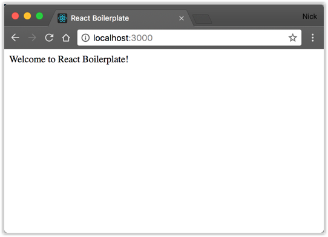

-----BEGIN PGP SIGNED MESSAGE-----
Hash: SHA512

# React Boiler Plate : Custom (along with server)
#### <em><strong>by zshmeta</strong><em>

### Before anything

Update your system and make sure you have latest version of 

- Node.js
- npm

Update npm :

>npm install -g npm@latest

Update node.js with npm:

>npm install -g n 
>n lts
> n latest
>n prune

install lts version of node.js
install latest version of node.js
remove old versions of node.js

### or use nvm

>curl -o- https://raw.githubusercontent.com/nvm-sh/nvm/v0.38.0/install.sh | bash
> nvm install node
> nvm uninstall node [version] # if necessary

# Methode Easy (but not advised):

In the root folder of your project run the following commands:

>npm init -y
> npx create-react-app "name-of-the-app"
> npm run start

## ATTENTION 
We use npx here for React (npm exec) to avoid installing create-react-app globally. This is a good practice to avoid polluting your global namespace with packages that are only used in a single project.

Nous utilisons npx ici (npm exec) pour éviter d'installer create-react-app globalement. C'est une bonne pratique pour éviter de polluer votre espace de nom global avec des paquets qui ne sont utilisés que dans un seul projet.

If you get any error just delete "./node-modules" and run the command again.
>rm -rf node_modules #(make sure to be in the right directory)

Make sure to update npm to the latest version

>npm install npm@latest -g
> npm install -g n
> n latest
> npm -v

# Methode "the Right Way" (but advised):

<em>After my intro to react i thought it to be a great step up in my programming journey.
If Linux taught me anything is that you will never be cared to better than if you care for yourself and that best will only ever be "Made From Scratch" so let's create our own customized boiler plate for react

Apres mon intro a react je me suis dit que c'etait un grand pas en avant dans mon parcours de developpeur. Si Linux m'a appris quelque chose c'est que tu ne seras jamais mieux soigné que si tu te soignes toi meme et que le mieux ce sera toujours "from scratch" Alors créons notre propre boiler plate customisé pour react.</em>

# React my first impression
# React mes premieres impressions

1. React is a library for building user interfaces that is super powerful with DOM manipulation and state management.
   it is i believe the best tool out there to interact with any object in your app and manipulate it's state. It's syntax isn't that hard and the logic applied is easy to assimilate. at least that is what i think...

2. React est une librairie pour construire des interfaces utilisateur qui est super puissante avec la manipulation du DOM et la gestion de l'état. la syntaxe n'est pas si difficile et la logique appliquée est facile à assimiler. du moins c'est ce que je pense ...

# Projet React Boiler Plate

Apres avoir toucher et fint quelque react projets il est temps de s'y mettre serieusementt.

After experimenting and building some react projects it's time to get serious about it.

## Requis

1.Web Browser
2.Node.js
3.npm

## Notes

since react is a framework it all starts with downloading all dependencies. Remeber that npm is scope limited so you will have to install all dependencies in the root folder of your project.

React est une framework et donc se compose de plusieurs dependances. Rappelons nous que npm se limite aux scope du dossier donc on fait attention a installer toutes les dépendances dans le dossier racine de votre projet.

## The Plate

The Structure is as follow:
reactBoilerPlate|
|---public/
|         |---index.html
|         |---manifest.json
|         |---robots.txt   
|         |---favicon.ico
|         |---somelogo.png
|         |---somelogo.png
|---src   /
|         |---components/
|         |             |---Comp.js
|         |             |---App.css
|         |             |---Comp2.js
|         |---client
|         |---server
|         |---App.css
|         |---App.js
|         |---App.test.js
|         |---index.css
|         |---index.js
|         |---logo.svg
|         |---reportWebVitals.js
|         |---setupTests.js
|---package.json
|---package-lock.json
|---README.md
|---.gitignore

x
## Installation

a)setup npm

ex. config:
{  "name": "reactBoilerPlate",  "version": "1.0.0",  "description": "Custom React Boilerplate",  "main": "index.js",  "scripts": {    "test": "echo \"Error: no test specified\" && exit 1"  },  "repository": {    "type": "git",    "url": "git+https://github.com/zshmeta/reactBoilerPlate"  },  "keywords": [    "Node",    "React"  ],  "author": "Nick Karnik",  "license": "Apache-2.0",  "bugs": {    "url": "https://github.com/zshmeta/reactBoilerPlate"  },  "homepage": "https://github.com/zshmeta/reactBoilerpPate#readme"}

b)install react
c)check build
d)check scripts
e)run node server
f)open your browser at localhost:3000

<strong> the command is </strong>
>npm init -y
>npm create-react-app "name-of-the-app"
>npm run build
>npm run start

Open your browser to:
http://localhost:3000/
and you should see your app.

<em>Notes: that is a lot of packages so make sur to add git .ignore to your project
>#.gitignore
> #Nodenode_modules
> #Nodenpm-debug.log
> #WebStorm.idea
> #Visual Studio Code.vscode
> #Project.vs
> etc....
</em>

## Structure

* Note: The structure is not set in stone and can be changed to fit your needs. The structure is just a suggestion.
* Note: La structure n'est pas gravée dans le marbre et peut être modifiée pour répondre à vos besoins. La structure est juste une suggestion.
* index.html is the main html file that will be served to the client. it can be in public or in src/client depending whether or not you will use a server.

Public/
index.html*
manifest.json
robots.txt
favicon.ico
somelogo.png
somelogo.png
Src/
components/
Comp.js
App.css
Comp2.js
client/
index.html*
server
App.css
App.js
App.test.js
index.css
index.js
logo.svg
reportWebVitals.js
setupTests.js
package.json
package-lock.json
README.md
.gitignore

##Create the static HTML boiler plate

>echo '<!DOCTYPE html>\n<html lang="en"><head>  \n <meta charset="UTF-8">  \n  <title>React Boilerplate</title></head>\n<body> \n   
        Welcome to React Boilerplate!    
\n</body>\n</html>' > public/index.html ## replace by  src/client/index.html if needed

## Express Web Server

This is pretty straight forward. We will use express to serve our static files and our react app.
As long as you make sure to only run these commands while inside your app folder it will all go smoothly

La il n'y as rien de compliqué. On va utiliser express pour servir nos fichiers statiques et notre application react.
Tant que vous vous assurez de ne lancer ces commandes que dans le dossier de votre application tout ira bien.

>npm install express --save

Create a file src/server/web.server.js
Creez un fichier src/server/web.server.js

Add the following to it:
Ajoutez le code suivant:

>const express = require('express)
> export default class WebServer { constructor() {    this.app = express();    this.app.use(express.static('dist/public'))  }  
> start() {    this.app.listen(3000, () => {      console.log('Web server listening on port 3000');    });  }}
>## OR
> export default class WebServer { constructor() {    this.app = express();    this.app.use(express.static('dist/public'))  }
>   start () {    return new Promise((resolve, reject) => {      try {        this.server = this.app.listen(3000, function () {          resolve()        })      } catch (e) {        console.error(e)        reject(e)      }    })  }
>  stop () {    return new Promise((resolve, reject) => {      try {        this.server.close(() => {          resolve()        })      } catch (e) {        console.error(e)        reject(e)      }    })  }}

* Promise Method https://developer.mozilla.org/en-US/docs/Web/JavaScript/Reference/Global_Objects/Promise

## Continue Setup

Create a file src/server/index.js
Add the following to it:
Creez un fichier src/server/index.js
Ajoutez le code suivant:

>import WebServer from './web.server'
> let webServer = new WebServer();webServer.start()  .then(() => {    console.log('Web server started!')  })  .catch(err => {    console.error(err)    console.error('Failed to start web server')  });

For now and for this specific setup we will need babel to add ES6 capabilities to our server.

>npm install @babel/core @babel/node @babel/preset-env --save-dev

Create a file .babelrc
Add the following to it:
Creez un fichier .babelrc
Ajoutez le code suivant:

>{ "presets": ["env"] }

Add the following to your package.json
it's a scripts that will allow us to build the app and start the server

Ajoutez le code suivant a votre package.json
c'est un script qui nous permettra de construire l'application et de lancer le serveur

>""scripts": {    "build": "npm run build-server && npm run build-client",    "build-server": "babel src/server --out-dir ./dist",    "build-client": "babel src/client --copy-files --out-dir ./dist/public",    "start": "node ./dist/index.js"}

If you getting an error check wether or not you have a .babelrc file in your root directory and if it is because of the existing public folder in your root directory you can change the name of the public folder to something else like public_html or something else and then move the index.html file to the new public folder.

# Starting Our App Up

>npm run build
> npm run start

Go to http://localhost:3000 and you should see the following:

## Commentaires

There are easier ways to do this but this is a neat and functioning way that has been consistently stable for me.
Il y a des manieres plus faciles de faire cela mais c'est une maniere propre et fonctionnelle qui a ete stable pour moi.

You can run tests by simply running :
Vous pouvez lancer les tests en executant simplement:

>npm test

## Credits

Remerciements a la communaute opensource pour l'inspiration et a mes prof et collegue de l'Afpa pour leur aide et leur soutien.

-----BEGIN PGP SIGNATURE-----

iQEzBAEBCgAdFiEEzpTcryMTmGfRVdU2OqS0MHlVcPIFAmQXVKAACgkQOqS0MHlV
cPLfFQgAnTQDrHwlT/bn0pIyQOa9cdD55bn0jqB1UwD2FrBzY4itruyDvIXBpVtz
n3KYDCk5xZI42sahWwNqpBH0GKMKubI9+eF7GF+BIJ0xSBSF/8+tJehJooeFcI1n
WhP5O7tj5ATiWucArQIv50ksBqP5YBUrpjJaCM8+2L3hlXBljq6gXoKaq09Iu19z
Pd+CcA/yIXmT6pXmVMd0kW7Ze9rdRUcfdVP5R2Up2V6pKV078xLvtTVVTtRGjitQ
VbHd1FuvRVF8z7WDOsQ2xnRKs6osDHMRdvQkEz6CRJ3lshSZRFFS98YopK6uF1nE
86OtNepEpeTzNwI7xx8kLWKJw3lwXg==
=qJZp
-----END PGP SIGNATURE-----
